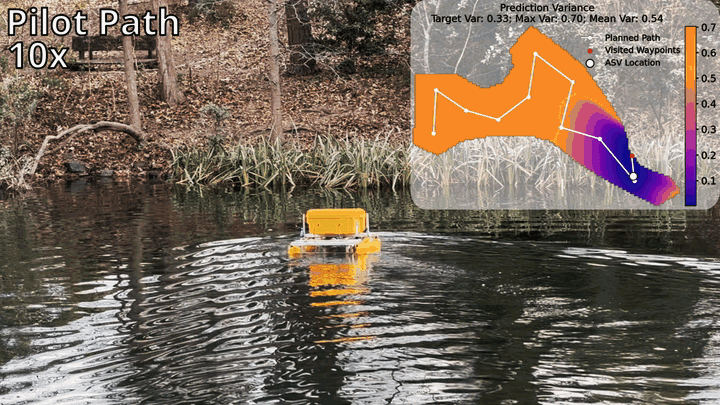

# Informative Path Planning with Guaranteed Estimation Uncertainty

[](https://arxiv.org/pdf/2602.05198)
[](https://roboticsconference.org/)
[](https://www.sgp-tools.com/)

<p align="center">
  
  
</p>
Official repository for the paper **"Informative Path Planning with Guaranteed Estimation Uncertainty"**, published at **Robotics: Science and Systems (RSS), 2026**.

This repository contains the benchmarking suite and scripts required to reproduce the figures and experimental results presented in the paper. Our core IPP planners—**GreedyCover** and **GCBCover**—are integrated into the [SGP-Tools](https://www.sgp-tools.com/) library.

<p align="center">
  
  
</p>

---

## 🛠 Repository Structure

```text
.
├── datasets/           # SRTM subsets (N02E021, N17E073, N45W123, N47W124)
├── appendix.ipynb      # Generates IPP solution figures for the paper appendix
├── cover.ipynb         # Reproduces the paper's cover page IPP solutions
├── fov.ipynb           # Coverage-map visualizations for the methods section
├── benchmark.py        # Main benchmarking script
├── plot.py             # Visualization script for results.json
├── requirements.txt    # Project dependencies
└── README.md
```

---

## 🚀 Getting Started

### 1. Environment Setup
We recommend using a virtual environment (`venv`) or `conda` to manage dependencies.

```bash
# Clone the repository
git clone https://github.com/itskalvik/uncertainty-guaranteed-ipp.git
cd uncertainty-guaranteed-ipp

# Install dependencies
python -m pip install -r requirements.txt
```
> 📝 Note  
> This installs `sgptools`, which relies on **TensorFlow** and **GPflow**. A GPU is not required.

### 2. LaTeX Dependency
The plotting scripts (`benchmark.py` and `plot.py`) use LaTeX for publication-quality rendering.
* **If you have LaTeX installed:** No changes needed.
* **If you do NOT have LaTeX:** Edit the scripts to set `matplotlib.rcParams["text.usetex"] = False`.

---

## 📊 Running Benchmarks

### Step 1: Run the IPP Planners
Execute the benchmark on one of the provided datasets by sweeping through target variance thresholds (expressed as ratios of the initial pilot model's max variance).

```bash
python3 benchmark.py ./datasets/N47W124.npy --variance-ratios 0.9 0.8 0.7 0.6 0.5
```

**Methods included:** `HexCover`, `GreedyCover`, `GCBCover`, and `GCBCover-Dist`.  
**Outputs:** Solution figures and a comprehensive `results.json` file.

### Step 2: Generate Plots
Once the benchmark completes, visualize the performance metrics (MSE, SMSE, Runtime, Distance, etc.):

```bash
# Set the specific results file generated in Step 1
python3 plot.py N47W124/Attentive/results.json
```

---

## 📝 Key Algorithms
The following planners are the primary contributions of this work:

* **GreedyCover:** An efficient greedy algorithm for near-optimal IPP with uncertainty guarantees.

* **GCBCover:** Balances information gain and travel costs to solve IPP with uncertainty guarantees under routing constraints.

For standalone use of these planners in your own projects, please refer to the [SGP-Tools documentation](https://www.sgp-tools.com/tutorials/uncertainty_guaranteed_IPP.html).

---

## 🎓 Citation

If you find this work useful for your research, please cite our RSS 2026 paper:

```bibtex
@inproceedings{JakkalaAOA26,
  author    = {Kalvik Jakkala and Saurav Agarwal and Jason O'Kane and Srinivas Akella},
  title     = {Informative Path Planning with Guaranteed Estimation Uncertainty},
  booktitle = {Robotics: Science and Systems (RSS)},
  year      = {2026},
  url       = {https://www.itskalvik.com/publication/uncertainty-guaranteed-ipp/}
}
```

---

## ⚖️ Notes on Reproducibility
* **Seeds:** `benchmark.py` sets `numpy` and `tensorflow` random seeds.
* **Hardware:** Minor variations in floating-point math may occur if running on a GPU; however, the algorithmic trends remain consistent.